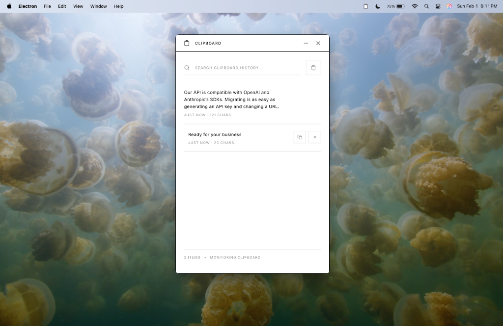

# Clipboard History Manager

A **multi-platform** clipboard history manager for macOS and Windows. Automatically captures copied text and displays it as easily accessible tiles.

Built with Electron. Minimalist black and white design.

---

## Screenshots



_Running on macOS with the Balenciaga-inspired minimalist dark theme._

---

## Features

- **Auto-capture** - Monitors system clipboard and captures new text automatically
- **Tile Display** - Each copied text appears as its own card
- **One-click Copy** - Copy button on each tile for quick re-copying
- **Search** - Filter through your clipboard history
- **Persistence** - History saved locally, survives app restart
- **System Tray** - Runs in background, accessible from menu bar

---

## Installation

### Prerequisites
You need **Node.js** installed on your computer.
- Download from: [nodejs.org](https://nodejs.org/)

### Quick Start

1. **Clone the repository**
   ```bash
   git clone https://github.com/aiforram1-stack/clipboard-history-manager.git
   ```

2. **Go into the folder**
   ```bash
   cd clipboard-history-manager
   ```

3. **Install dependencies**
   ```bash
   npm install
   ```

4. **Run the app**
   ```bash
   npm start
   ```

The app will launch and appear in your system tray (menu bar).

---

## Building for Distribution

### macOS

```bash
npm run build:mac
```

Output: `dist/` folder containing `.dmg` and `.zip` files

### Windows

```bash
npm run build:win
```

Output: `dist/` folder containing installer and portable executable

---

## Usage

1. Launch the app
2. Copy any text from any application using Cmd+C (Mac) or Ctrl+C (Windows)
3. The copied text appears as a new tile in the app
4. Hover over a tile to reveal copy and delete buttons
5. Click the copy button to re-copy that text to your clipboard
6. Use the search bar to filter through your history
7. Click the trash icon to clear all history

The app runs in your system tray. Click the tray icon to show or hide the window.

---

## Project Structure

```
clipboard-history-manager/
├── main.js          # Electron main process, clipboard monitoring
├── preload.js       # Secure IPC bridge
├── index.html       # App UI layout
├── styles.css       # CSS styling
├── renderer.js      # Frontend logic
├── package.json     # Dependencies and scripts
└── assets/
    └── icon.png     # App icon
```

---

## Technical Details

- **Clipboard Monitoring**: Polls system clipboard every 500ms
- **Storage**: Uses electron-store for persistent local storage
- **Max History**: Stores up to 50 items (configurable)
- **Duplicate Handling**: Existing items are moved to top instead of creating duplicates

---

## License

MIT
